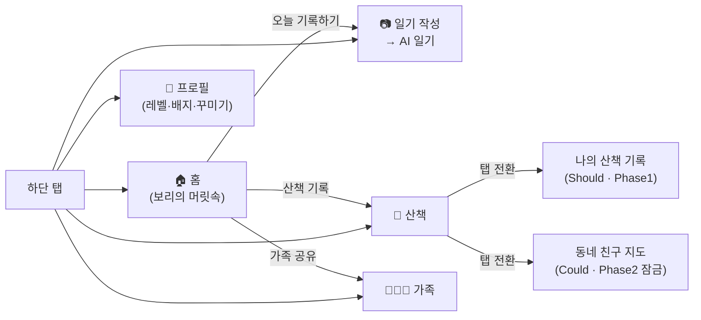
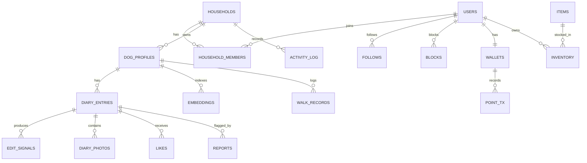
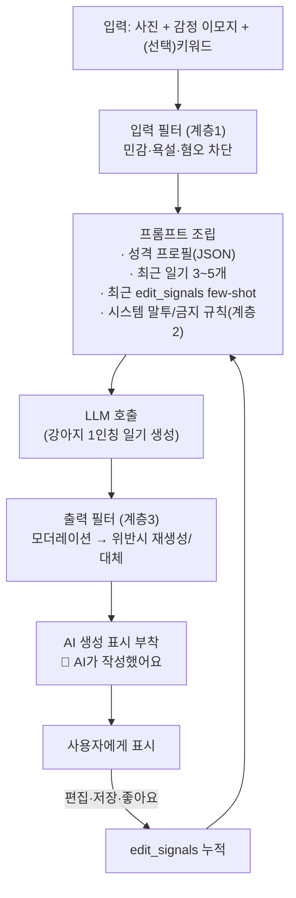
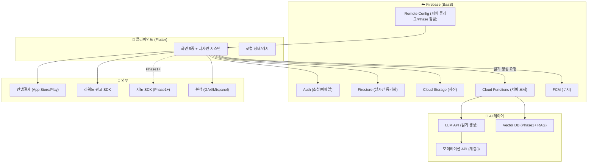

# 🐾 강아지의 시선 — 기획 · 기술 설계서 (Engineering Spec) v1.0

> **이 문서의 성격**: 코딩 시 참고하거나 다른 개발자에게 그대로 인계할 수 있는 **설계서형 기획서**.
> Notion에 쌓인 6개 문서(기획 초안 · PRD · 사업성 검증 · 사업 기획서 · BM 설계서 · AI 일기 설계)와
> [HTML 프로토타입](https://tinklewhale.github.io/puppyrecord_gyeonjungsa/)을 모두 반영해 통합 정리했다.
>
> 작성 기준일: 2026-05-31 · 대상 독자: 기획자(PO) / 앱 개발자 / 백엔드·AI 개발자 / 외주사

---

## 0. 한눈에 보기 (Executive Summary)

| 항목 | 내용 |
|---|---|
| **제품명** | 강아지의 시선 (가제) |
| **한 줄 정의** | "우리 강아지가 직접 쓰는 1인칭 일기장 + 가족이 함께 보는 반려 다이어리" |
| **핵심 가설** | 보호자는 긴 글 대신 `[사진 1장 + 감정 이모지]`만으로 AI가 대신 써주는 강아지 1인칭 일기를 **매일** 쓰게 된다 |
| **차별화 축** | 감성 콘텐츠(강아지 빙의 + AI 1인칭 일기) — 국내외 경쟁사 모두 비어 있는 시장 |
| **MVP 범위(Phase 0)** | ①강아지 빙의 홈 ②AI 1인칭 일기 ③가족 공동육아 동기화 ④기본 피드/좋아요/팔로우 ⑤신고·차단·필터 |
| **MVP에서 제외** | 위치 기반 친구찾기(법적·안전 최대 리스크 → Phase 2), 실시간 GPS·웨어러블(Phase 3) |
| **권장 스택(요약)** | Flutter(앱) · Firebase(Auth/Firestore/Storage/Functions/FCM) · LLM API(일기 생성) · Mixpanel/GA4(분석) |
| **검증 지표** | 일기 생성률, D1/D7/D30 리텐션, 사진→일기 전환율 / 임계값: D7 < 20%면 가설 재검토 |

> **설계 원칙 한 줄**: "무료 감성 콘텐츠로 리텐션 → 꾸미기·구독으로 수익화 → 커머스·제휴로 확장." 핵심 감성 경험(빙의 홈·일기 생성)은 **항상 무료**로 유지한다.

---

## 1. 제품 개요 & 비전

- **비전**: 인간 중심의 딱딱한 펫 앱이 아니라, 반려견의 시선으로 소통·교류하는 몰입형 감성 플랫폼.
- **해결하려는 문제**
  1. 기존 펫 앱은 커머스·등록·헬스케어 중심 → 보호자의 *감성적 교류 욕구*를 못 채운다.
  2. 긴 글 SNS는 작성 부담이 커서 *반려 일상 기록이 지속되지 않는다*.
  3. 가족이 한 마리를 함께 키우는데 *상태를 실시간 공유할 자연스러운 도구가 없다*.
- **시장 근거**: 국내 반려동물 연관산업 2022년 약 8.5조원 → 2032년 약 21조원 전망(삼정KPMG). 반려인 1,546만 명·591만 가구(KB금융 2025). 단, 커뮤니티 단독 수익화는 한계 → 커머스/구독 하이브리드 필수.

### 1.1 경쟁 포지셔닝
- 펫프렌즈(커머스)·포동(정보 커뮤니티)·Dogo(훈련)와 **정면충돌 회피**.
- 빈 시장 = "감성 콘텐츠(강아지 빙의 + AI 1인칭 일기)" 단독 점유.
- 해외도 "감성/AI 1인칭 콘텐츠 + 위치기반 SNS" 결합 모델은 비어 있음(BarkHappy·Dogo·Tractive 각각 인접하나 결합 안 됨).

---

## 2. 타깃 사용자 & 페르소나

- **1차 타깃**: 20~40대 반려견 보호자 (펫 앱 사용자 여성 72%, 20~40대 90% 집중).
- **사용 맥락**: 가족 구성원이 한 마리를 공동으로 키우는 가구.
- **핵심 페르소나**: 강아지를 '아이처럼' 대하며 일상을 기록·공유하고 싶지만, **긴 글쓰기는 번거로워 하는** 보호자.

---

## 3. 핵심 컨셉 — 3대 차별화 포인트

| # | 포인트 | 설계 핵심 | 비고 |
|---|---|---|---|
| 1 | **강아지 빙의 UI/UX** | 긴 글 대신 `[사진 1장 + 감정 이모지]` 중심의 강아지 1인칭 독백 | 차별화 1순위 |
| 2 | **사생활 보호 스마트 토글** | 산책할 때만 켜는 '안심 ON/OFF' (목줄 채우기 감성 연출) | 위치는 Phase 1~2 |
| 3 | **가족 공동육아 동기화** | 여러 보호자가 1개 프로필을 실시간 공동 관리 | 리텐션 핵심 |

> **말투/컨셉을 설계 단계부터 유지하라.** 메인 화면 이름은 '보리 홈'이 아니라 **'보리의 머릿속'**, 버튼은 '위치 전송'이 아니라 **'엄마한테 나 여기 있다고 멍멍 짖기'**. 카피·UX 라이팅은 코드 상수가 아니라 별도 i18n/카피 테이블로 분리해 톤을 일관 관리한다.

---

## 4. 정보 구조(IA) & 화면 흐름

프로토타입 기준 5개 메인 화면 + 하단 5탭 네비게이션. (`index.html` 분석 결과)

```
하단 네비게이션: [⌂ 홈] [♧ 산책] [＋ 일기추가] [♣ 가족] [♙ 프로필]
```



---

## 5. 화면별 상세 명세 (프로토타입 기반)

프로토타입은 정적 데모(localStorage·서버 없음). 아래는 **실제 구현 시 채워야 할 데이터/동작/Phase**를 매핑한 것이다.

### 5.1 홈 — `#home` (보리의 머릿속)
- **구성**: 펫 스위처(`보리⌄`, 다견 전환), 알림 버튼, 시간대 인사("좋은 아침이멍! ☀"), **말풍선("보리의 머릿속")**, `📷 오늘 기록하기` 1차 CTA, 퀵행(산책/간식/가족), '오늘의 일기' 카드.
- **동작/데이터**:
  - 인사·말풍선은 **시간대 + 강아지 상태 + 성격 프로필** 기반 동적 카피(클라이언트 룰 또는 경량 템플릿). LLM 호출 없이 템플릿으로 시작, 후에 개인화.
  - '오늘의 일기' 카드 = 최신 `diary_entries` 1건(좋아요·댓글 수·날짜).
  - 펫 스위처 = 현재 가족이 보유한 `dog_profile` 목록.
- **Phase**: Phase 0 (Must).

### 5.2 일기 작성 → AI 일기 — `#diary`
- **구성**: 기분 선택(신났멍/행복했멍/졸렸멍/우울했멍/화났멍), 사진 업로드(최대 5장), 키워드 칩(산책/간식/놀이/병원), `AI 일기 만들기 ✨`, 결과 카드 + **`🐾 AI가 작성했어요` 라벨(AI 기본법 의무)**.
- **동작/데이터**: 사진 업로드 → Storage, 감정·키워드 + 강아지 성격 프로필 → LLM 호출 → 1인칭 일기 생성 → 3계층 안전필터 → 표시·저장. (상세: §8 AI 파이프라인)
- **Phase**: Phase 0 (Must, 핵심 가설).

### 5.3 산책 — `#walk`
- **구성**: 탭 2개 `나의 산책 기록`(active) / `동네 친구 지도`, 지도(경로·영역표시·핀), **안심 위치공유 토글**(`🔒 가족에게만 기록 중` ↔ `🟢 안심 위치 공유 ON`), 산책 요약(거리/시간/영역표시), `▶ 산책 시작하기`, Phase 안내 노트.
- **동작/데이터**:
  - 프로토타입이 이미 **Phase를 라벨로 구분**한다: 나의 산책 기록 = `Should Have`(Phase 1), 동네 친구 지도 = `Could Have · Phase 2`(신고·안전설계 후 잠금 해제).
  - 토글 ON 시에도 "산책 중에만, 근사 위치, 상호 동의" 카피를 노출 — 규제 설계가 UI에 그대로 박혀 있음.
- **Phase**: 산책 기록 Phase 1 / 친구 지도 Phase 2. **MVP에서는 잠금/비활성 또는 '준비 중' 처리.**

### 5.4 가족 — `#family`
- **구성**: 보호자 목록(엄마/아빠/누나 + `＋초대하기`), 오늘의 활동 타임라인(산책 완료·간식 지급·약 먹음·빗질 — 누가 했는지 표시).
- **동작/데이터**: 가족 = `household` 멤버십. 초대 = 딥링크/초대코드. 활동 타임라인 = 공유 `activity_log`(실시간 동기화).
- **Phase**: Phase 0 (Must, 리텐션 핵심).

### 5.5 프로필 — `#profile`
- **구성**: 강아지 기본정보(말티즈·3살·남아), **Level 12 / EXP 바**, 통계(총 일기/산책/좋아요), **성장 배지(4/12)**.
- **동작/데이터**: 게이미피케이션 = 일기·산책 활동 → EXP·레벨·배지. **꾸미기 아이템(BM)과 직결** — 캐릭터 아바타·배경·테마는 여기서 적용.
- **Phase**: 레벨/배지 Phase 0(가벼운 버전) → 꾸미기 상점·포인트 Phase 0~1 수익화.

### 5.6 공통 컴포넌트
- 상단 status bar, 하단 nav(5탭, 가운데 ＋), **토스트**(`showToast`), 카드/칩/무드 버튼 선택 상태 토글.
- 프로토타입의 인터랙션 패턴(선택 토글·토스트·탭 전환·스위치 on/off)을 **디자인 시스템 컴포넌트**로 추출해 재사용.

---

## 6. 기능 우선순위 (MoSCoW) & 단계 로드맵

### 6.1 MoSCoW
- **🔴 Must (Phase 0, 노코드로 핵심 가설 검증)**
  1. 강아지 빙의 홈 UI
  2. `[사진+감정 이모지]` → AI 1인칭 일기 생성 (+ AI 생성 표시)
  3. 가족 공동육아 동기화
  4. 기본 피드/좋아요/팔로우
  5. 신고·차단·필터·연락처 게시 (**Apple 1.2 UGC 의무**)
- **🟡 Should (Phase 1)**
  1. 산책 기록(본인·가족용, 외부 미노출)
  2. AI 일기 톤/캐릭터 커스터마이징(견종·성격)
- **🟢 Could (Phase 2, 위치기반서비스 신고 + 안전장치 후)**
  1. 안심 ON/OFF 산책 중 위치공유(가족 → 친구)
  2. 동네 친구 지도·영역표시 (**최대 리스크, 반드시 후순위**)
- **⚪ Won't (MVP 제외)**
  1. 실시간 GPS, 스마트 웨어러블(목걸이 칩) — Phase 3

### 6.2 단계별 로드맵

| Phase | 시점 | 범위 | 위치기반서비스 신고 |
|---|---|---|---|
| **Phase 0 (MVP)** | 지금~약 3개월 | 위치 없이 감성 3종 + 가족 동기화. AI 표시 의무 준수 | 불필요 |
| **Phase 1** | PMF 신호 확인 시 | 산책 기록(본인·가족 한정), 백그라운드 GPS·실시간 동기화 안정화, 수익화(포인트/구독) 검증, **RAG 메모리 도입 검토** | 신고 착수 |
| **Phase 2** | 신고 완료 + 안전설계 후 | 동네 친구 지도(근사위치·상호동의·기본OFF·14세미만차단·즉시숨김), 100m 조우 푸시 | 필수 |
| **Phase 3** | 최종 | 실시간 GPS + 스마트 웨어러블(심박·체온·활동량) 생체데이터 융합 | — |

> **Phase 0 검증 질문**: "강아지 1인칭 일기를 매일 쓰게 되는가?" → 일기 생성률 · D7 리텐션으로 판정.

---

## 7. 데이터 모델 (ERD)

AI 설계 문서의 `dog_profile / diary_entries / edit_signals / embeddings` 구조를 기준으로 전체 도메인을 확장했다.



### 7.1 주요 테이블 정의

| 엔티티 | 핵심 필드 | 비고 |
|---|---|---|
| `users` | id, 닉네임, 생년(14세 미만 판별), 동의항목(약관·위치·AI), 가입경로 | 만 14세 미만 → 법정대리인 동의 플로우 |
| `households` | id, 이름, 생성자 | 가족(공동육아) 단위 |
| `household_members` | household_id, user_id, role(엄마/아빠/누나 등), 권한 | 멀티 보호자 |
| `dog_profiles` | id, household_id, 이름, 견종, 나이, 성별, **성격태그(JSON)**, 고정설정(자주 가는 장소·가족 호칭·선호) | 페르소나의 핵심 |
| `diary_entries` | id, dog_id, author_id, 사진참조[], 감정, 키워드[], 본문, ai_generated(bool), 생성시각 | AI 생성 여부 플래그 필수 |
| `edit_signals` | id, diary_id, 원문, 수정문, 유형(어투/단어/길이/전면재작성), 가중치 | **성격 학습의 가장 강력한 신호** |
| `embeddings` | id, dog_id, 출처(diary), 벡터, 메타 | **Phase 1+** RAG 메모리 |
| `walk_records` | id, dog_id, 경로(좌표 배열), 거리, 시간, 영역표시, 공유범위(self/family/friends) | Phase 1+, 위치 |
| `activity_log` | id, household_id, actor_id, 유형(산책/간식/약/빗질), 시각 | 가족 타임라인 |
| `follows / likes` | 소셜 그래프 최소 단위 | Phase 0 |
| `reports / blocks` | 신고·차단 | **Apple 1.2 의무** |
| `wallets / point_tx` | 포인트 잔액·내역(충전/광고/소비) | BM |
| `items / inventory` | 꾸미기 아이템(의상·배경·테마), 등급(기본/일반/프리미엄), 보유 | BM |

> **소유권/격리 원칙**: 프로필·일기는 해당 가족(공동육아 구성원)에게만 공유. 타인 강아지 데이터는 격리. 유저 데이터는 **그 유저 응답에만** 쓰고 공용 모델에 섞지 않는다(파인튜닝 회피 → 동의·공지 부담 ↓). 탈퇴 시 삭제·내보내기 제공.

---

## 8. AI 1인칭 일기 — 핵심 기술 설계

> **한 줄 결론**: 핵심 가치는 "범용 AI 말투"가 아니라 **"우리 강아지 고유의 말투"**. 따라서 핵심 기술은 대형 모델 자체가 아니라 **강아지별 페르소나 + 과거 일기 메모리를 매번 프롬프트에 주입하는 설계**다. 초기엔 파인튜닝이 아니라 **"구조화 프롬프트 + 경량 RAG"**로 충분.

### 8.1 생성 파이프라인



### 8.2 "학습"의 세 가지 의미 (오해 방지)

| 방식 | 설명 | 비용/난이도 | 전략 |
|---|---|---|---|
| ① 프롬프트 개인화(In-context) | 프로필·과거일기를 매번 주입 | 낮음 | **MVP 채택** |
| ② RAG 메모리 검색 | 과거 기록 벡터화 후 상황별 주입 | 중간 | Phase 1 "더 잘하기" |
| ③ 파인튜닝 | 유저 데이터로 모델 가중치 수정 | 높음 | 당분간 불필요 |

> **개발자 주의**: "성격 학습"을 ③ 파인튜닝으로 오해하면 비용·일정이 폭발한다. 체감상 "학습"은 **①+②로 거의 달성**된다. "학습 = 모델 가중치 변경"이 아니라 **"프롬프트에 주입되는 구조화 텍스트 블록(프로필) + 정답 예시(edit_signals)를 업데이트하는 것"**이다.

### 8.3 성격 프로필 — 강아지 MBTI
- **초기 설정**: 회원가입→강아지 등록 시 **강아지용 MBTI 설문**(필수 강제 X, 언제든 설정에서 가능 → 온보딩 이탈 방지). 미완료 시 견종·나이 기반 기본 페르소나.
- **축 예시(4~5개)**: 에너지(활발↔차분), 애정표현(애교↔도도), 호기심(탐험↔신중), 식탐(많음↔적음), 사회성(환영↔낯가림).
- 각 문항 2~4지선다, 탭 몇 번에 종료. 결과 = "보리는 활발한 탐험가 애교쟁이!" 캐릭터 카드 + 내부 JSON 태그.
- **MBTI 형식인 이유**: 완료율↑ · 공유 바이럴 · "내 아이를 분석해줬다" 몰입감.

### 8.4 지속 학습 = 일기 편집 신호
- 견주가 AI 일기를 **직접 고쳐 쓴 문장**이 가장 강력한 신호("우리 아이는 이렇게 말 안 해" = 정답 말투 데이터).
- 편집/저장 → `edit_signals` 저장 → 다음 생성 시 최근 수정본 few-shot 주입 → 점점 "우리 아이 말투"로 수렴.
- 수집 신호: 어투 수정(`~했멍`→`~했어요`), 단어 교체(호칭), 길이·톤, 전면 재작성(강한 가중).
- **선순환**: MBTI 초기 페르소나 → AI 생성 → 편집·저장 → few-shot 주입 → 공감도↑ → 수정 빈도↓ → 충성도↑.

### 8.5 금칙어/안전 — 3계층 방어
1. **계층1 입력 필터**: 사용자 키워드/메모의 민감·욕설·혐오 → 생성 전 차단.
2. **계층2 생성 제약**: 시스템 프롬프트에 말투 규칙 + 금지(정치·종교·성·폭력·특정 인물·자해·학대 암시 금지).
3. **계층3 출력 필터**: 생성물 재검사, 위반 시 재생성 또는 안전 문구 대체(상용 모더레이션 API 활용).
- **아동 안전**: 귀여운 톤 때문에 부적절 표현이 "귀엽게" 포장될 위험 → 2·3계층 이중 차단.
- **AI 기본법 연계**: 출력에 "AI가 작성" 표시 + 약관 고지 자동 부착.

### 8.6 RAG 도입 시점
- **MVP는 RAG 없이** "구조화 프롬프트 + 최근 일기 3~5개 주입"으로 충분(강아지 1마리당 일기 수가 적음).
- 일기가 수십~수백 개로 늘면 임베딩 + 벡터검색으로 전환. **RAG는 MVP 필수가 아니라 Phase 1 과제**임을 개발자와 명확히 합의.

---

## 9. 시스템 아키텍처 & 기술 스택 ⭐

### 9.1 아키텍처 개요



> **중요**: LLM API 키는 클라이언트에 두지 않는다. **Cloud Functions를 게이트웨이**로 두고 거기서 LLM·모더레이션을 호출 → 키 보호, 횟수 제한(무료 일일 한도), 비용 통제, 안전필터 강제.

### 9.2 권장 스택 (Phase 0 MVP)

| 레이어 | 권장 | 선택 이유 | 대안 |
|---|---|---|---|
| **앱(프론트)** | **Flutter** (Dart) | iOS/Android 단일 코드베이스, 감성 애니메이션 UI에 강함, 국내 개발 인력 풍부, FlutterFlow 노코드와 호환(코드 이관 용이) | React Native |
| **상태관리** | Riverpod (또는 Bloc) | 테스트·확장성 | Provider |
| **백엔드(BaaS)** | **Firebase** | 가족 **실시간 동기화 = Firestore 리스너**가 천연 적합, Auth·Storage·FCM·Functions 원스톱, MVP 속도 | Supabase(Postgres) |
| **서버 로직** | Cloud Functions (TypeScript) | LLM 게이트웨이, 일기 생성·필터·결제 검증 | — |
| **AI 일기 생성** | LLM API (비용효율 소형 instruct 모델 + 프롬프트 캐싱) | 고빈도 일기 생성 → 원가 관리가 핵심. 말투는 프롬프트로 제어 | 모델은 교체 가능하게 추상화 |
| **모더레이션** | 상용 모더레이션 API (계층3) | 출력 안전 검사 | 자체 금칙어 + 규칙 |
| **푸시** | FCM | 가족 활동·일기 알림 | — |
| **분석** | GA4 + Mixpanel(또는 Amplitude) | KPI 퍼널(사진→일기 전환 등) | Firebase Analytics |
| **결제(BM)** | App Store / Google Play 인앱결제 | 포인트 충전·구독 | RevenueCat(영수증 검증 단순화 권장) |
| **광고(BM)** | 리워드 광고 SDK(AdMob 등) | 무과금 포인트 적립 | — |
| **CI/CD** | Codemagic 또는 GitHub Actions + Fastlane | Flutter 빌드/배포 | — |
| **에러/모니터링** | Firebase Crashlytics + Sentry | 안정성 | — |

### 9.3 Phase별 추가 스택

| Phase | 추가 기술 |
|---|---|
| **Phase 1** | 지도 SDK(네이버/카카오/Google Maps), 백그라운드 위치(geolocator + background fetch), **Vector DB**(pgvector 또는 매니지드 벡터 서비스) for RAG, Websocket/실시간 동기화 강화 |
| **Phase 2** | 위치기반서비스 신고 완료 후 친구 지도, 근사위치(geohash 단위), 상호동의 소셜 그래프, 14세미만 차단 게이트 |
| **Phase 3** | BLE/GPS 웨어러블 연동, 생체데이터 시계열 저장(시계열 DB), 헬스케어 구독 |

### 9.4 노코드(FlutterFlow) vs 코드(Flutter) — 의사결정

| 기준 | FlutterFlow (노코드) | Flutter (코드) |
|---|---|---|
| 속도/초기비용 | ✅ 매우 빠름, 대표님 직접 제작 가능 | 보통 |
| 커스텀 애니메이션(목줄 채우기 등) | △ 제약 | ✅ 자유 |
| **iOS 심사** | ⚠️ **리젝 사례 빈번**(crash on launch, 유사 바이너리 spam, 인앱결제 3.1.1) | ✅ 통제 가능 |
| LLM/RAG/복잡 로직 | △ Custom Function 한계 | ✅ |
| 개발자 인계 | △ 락인 우려 | ✅ 표준 |

> **권고**: Phase 0 가설 검증·팬덤 확보는 **FlutterFlow로 빠르게** 시작하되, **인앱결제·LLM 호출 같은 심사 민감/복잡 로직은 Custom Code 또는 Cloud Functions로 분리**한다. PMF 신호가 보이면 Flutter 네이티브 코드베이스로 이관(FlutterFlow는 Flutter 코드 export 가능). 출시 전 반드시 **iOS 심사 체크리스트**(퍼포스 스트링·결제 플로우)를 점검.

---

## 10. 비기능 요구사항 & 컴플라이언스 (설계 제약) ⚠️

> 🚨 **가장 큰 리스크는 전부 "위치"에 집중**되어 있다 → MVP에서 위치 친구찾기를 빼는 결정적 이유. ("동네 친구 지도"는 Girls Around Me(2012) 퇴출의 직접 선례.)

### 10.1 법규 체크리스트 (개발 착수 전 합의)

| 규제 | 요구사항 | 구현 대응 | 적용 Phase |
|---|---|---|---|
| **위치정보법** | 개인위치정보 수집·이용·제공 시 방통위 **위치기반서비스사업 신고 필수**(미신고 3년↓/3천만원↓). 소상공인 특례(1개월 유예 후 간소화) | MVP는 위치 미수집 → 신고 불필요. Phase 1부터 신고 착수 | Phase 1+ |
| **개인정보보호법·정보통신망법** | 만 14세 미만 → 법정대리인 동의 필수. 위치는 더 엄격(법정대리인 + 본인 동의 별도), 위치추적 기본 OFF | 가입 시 생년 수집 → 14세 미만 분기, 위치기능 차단 게이트 | Phase 0(연령)/Phase 2(위치) |
| **AI 기본법(2026.1.22 시행)** | 생성형 AI 결과물에 **AI 생성 표시**(워터마크/문구/메타데이터) + 약관·UI 고지(미이행 3천만원↓ 과태료, 1년 계도) | `🐾 AI가 작성했어요` 라벨 + `ai_generated` 메타 + 약관 고지 | **Phase 0 필수** |
| **Apple 1.2 (UGC 4대 의무)** | ①부적절 콘텐츠 필터링 ②신고+적시 대응 ③악성 유저 차단 ④연락처 공개 | 모더레이션 + 신고/차단 기능 + 약관에 연락처 | **Phase 0 필수** |
| **Apple 5.1.5 / 5.1.1(ii)** | 위치 수집·전송·이용 전 고지·동의, **퍼포스 스트링** 명확히 | Info.plist 퍼포스 스트링, 동의 화면 | Phase 1+ |
| **Google Play 스토커웨어 정책** | 부모-자녀/기업관리 외 타인 위치추적 금지. 백그라운드 위치 별도 승인 | 친구 지도는 상호동의·근사위치만 | Phase 2 |

### 10.2 "동네 친구 지도"가 최대 리스크인 이유 (Phase 2 안전설계 필수조건)
강아지 실시간 위치 = 사실상 보호자(사람)의 실시간 위치. 리스크가 4개 층(① 위치정보법 신고 ② 스토킹·역추적 ③ 아동 보호 ④ 앱스토어 심사)으로 겹친다. 특히 **영역표시(마킹)**는 집 위치 + 생활 패턴까지 추론시켜 일회성 위치보다 위험.

> **통제 방법 = 위치를 빼는 게 아니라 노출 범위를 단계적으로 좁힌다.**
> - Phase 1: 위치는 "산책 기록(본인·가족만)"으로만 → 외부 노출 0
> - Phase 2(신고 후): ⓐ정확좌표 대신 동/단지 수준 **근사위치** ⓑ**상호 동의**한 친구끼리만 ⓒ**기본 OFF** ⓓ**14세 미만 차단** ⓔ끄면 **즉시 숨김** — 안전장치 전부 갖춘 뒤에만.
> 리스키한 건 "위치를 쓴다"가 아니라 **"실시간 위치를 + 모르는 사람에게 + 정확한 좌표·패턴으로 노출"** 세 조건 동시 성립. 하나라도 끊으면 리스크 급감.

### 10.3 기타 NFR
- **성능**: 일기 생성 응답 체감 < 3~5초(로딩 모션으로 체감 완화), 사진 업로드 압축.
- **보안**: LLM 키 서버 보관, Firestore 보안 규칙으로 가족 단위 격리, 영수증 서버 검증.
- **프라이버시**: 사진·일기 = 개인정보 → 수집·처리 동의, 탈퇴 시 삭제·내보내기.
- **확률형 아이템 금지**: 랜덤박스는 국내 확률형 규제 대상 → 초기엔 **확정형 꾸미기 아이템만**.

---

## 11. 수익 모델 (구현 관점)

> 원칙: 핵심 감성 경험(빙의 홈·일기 생성)은 항상 무료. 수익화가 이를 가리지 않게.

### 11.1 핵심 BM — 포인트 기반 캐릭터 꾸미기
- 사용자는 강아지 아바타 꾸미기 아이템(의상·액세서리·배경·테마)을 **포인트로 구매**.
- 포인트 획득 2경로: **현금 충전(인앱결제)** / **리워드 광고 시청(일일 상한, 예: 1일 5회)**.
- 아이템 등급: 기본(무료) / 일반(포인트) / 프리미엄·시즌 한정(고포인트 또는 현금).
- 꾸미기 결과를 **홈·AI 일기 썸네일에 반영** → 꾸미고 싶은 동기 극대화 → 프로필 화면(레벨/배지)과 연결.

### 11.2 보조 BM 5선
1. **프리미엄 구독**: AI 일기 무제한(무료는 일일 한도), 프리미엄 캐릭터·테마 자동 해금, 광고 제거, 월간 앨범. *AI API 원가를 직접 전가 → 마진 방어.*
2. **커머스/제휴**: 프로필(견종·생애주기·활동량) 기반 맞춤 추천, AI 일기 맥락 기반 추천("풀냄새 맡았멍"→산책용품).
3. **AI 굿즈/포토북**: 쌓인 일기·사진 → 포토북·캘린더·커스텀 굿즈(주문형, 재고 리스크 0).
4. **B2B 제휴·광고/입점**: 동물병원·펫샵·보험사 제휴, 지역 쿠폰(Phase 2 위치 연계).
5. **하드웨어·헬스케어 구독(Phase 3)**: 스마트 목걸이 칩 + 생체데이터 월구독(Tractive 모델).

### 11.3 단계별 주력 수익원

| Phase | 주력 | 보조 |
|---|---|---|
| Phase 0 | 광고 포인트 적립 | 포인트 현금 충전(꾸미기) |
| Phase 1 | 프리미엄 구독 | AI 굿즈/포토북, 커머스 제휴 |
| Phase 2 | 지역 입점 광고/B2B | 커머스 확대 |
| Phase 3 | 하드웨어+헬스케어 구독 | 전 수익원 통합 |

> **결제 주의**: 인앱결제 수수료(약 15~30%) 반영해 포인트 단가 설계. FlutterFlow 인앱결제(3.1.1) 리젝 사례 → 출시 전 결제 플로우 검증. 리워드 광고 SDK는 14세 미만 광고 정책·개인정보 고지 준수.

---

## 12. KPI / 분석 이벤트 설계

| 분류 | 지표 | 분석 이벤트(예시) |
|---|---|---|
| **핵심 가설** | 일기 생성률(가입자당 주간), 사진→일기 전환율 | `diary_generate_start`, `diary_generate_success`, `diary_save` |
| **공감도(AI 품질)** | 수정 없이 저장 비율, 생성 후 좋아요/저장율, **재생성률(↓이 좋음)** | `diary_edit`, `diary_regenerate`, `diary_like` |
| **리텐션** | D1/D7/D30 | (코호트) |
| **소셜** | 가족 초대 수락률, 팔로우/피드 상호작용률 | `family_invite_sent/accepted`, `feed_like/comment` |
| **수익(Phase 1+)** | 포인트 구매율, 광고 시청률, 프리미엄 전환율 | `point_purchase`, `ad_reward_complete`, `subscribe` |
| **성격 학습** | 프로필 성숙도(N일내 성격 수정 가구 비율), MBTI 완료율 | `mbti_complete`, `profile_tag_update` |
| **안전** | 금칙어 필터 적발률, 오차단율 | `moderation_block` |

> **임계값(가설 기각선)**: D7 리텐션 < 20% → 감성 콘텐츠 가설 재검토 / 가족 동기화 사용 가구 < 30% → 공동육아 가치 재평가. "수정 없이 저장 비율" 상승 추세 = 성격 학습 성공의 핵심 측정치.

---

## 13. 리스크 & 대응 (요약)

| 리스크 | 대응 |
|---|---|
| 위치정보법·스토커웨어 (최대) | MVP 위치 제외, Phase 1 신고 착수 후 단계 개방, 근사위치·상호동의·기본OFF |
| AI 기본법 표시 의무 | `🐾 AI가 작성했어요` + 약관 고지 + 메타데이터 |
| FlutterFlow iOS 리젝 빈발 | 심사 체크리스트 점검, 심사 민감 로직 Custom/Functions 분리, 필요시 네이티브 전환 |
| 커뮤니티 단독 수익 한계 | 초기부터 꾸미기·구독 하이브리드 |
| AI API 비용 증가 | 무료 일기 일일 횟수 제한 + 프리미엄 무제한으로 원가 전가, 프롬프트 캐싱, 소형 모델 |
| 아동 안전 | 2·3계층 모더레이션 이중 차단, 14세 미만 분기 |

---

## 14. 개발 착수 체크리스트 / Next Actions

**기획·법무**
- [ ] 위치정보법 신고 시점(Phase 1) 및 소상공인 특례 적용 여부 법률 자문
- [ ] AI 기본법 표시 문구·약관 초안 확정
- [ ] 14세 미만 처리 정책(수집 여부/법정대리인 동의 플로우) 결정

**설계**
- [ ] 디자인 시스템 토큰 추출(프로토타입 색상: `--green #91ad4b`, `--cream #fbf8f1` 등 → Figma 변수화)
- [ ] 화면 5종 + 온보딩(MBTI 설문) 와이어프레임 확정
- [ ] 데이터 모델(§7) Firestore 컬렉션 구조 + 보안 규칙 설계
- [ ] LLM 프롬프트 템플릿(시스템 말투·금지 규칙·few-shot) 초안 + 강아지 말투 샘플 수집

**개발 (Phase 0)**
- [ ] Flutter 프로젝트 + Firebase 연동(Auth/Firestore/Storage/FCM)
- [ ] 홈·일기·가족·프로필 화면 + 하단 네비 구현(프로토타입 인터랙션 이식)
- [ ] Cloud Functions LLM 게이트웨이(생성 + 3계층 필터 + AI 표시 + 일일 한도)
- [ ] 신고·차단·필터(Apple 1.2) 구현
- [ ] 분석 이벤트(§12) 심기 + 퍼널 대시보드
- [ ] iOS/Android 심사 체크리스트 점검 후 비공개 베타 출시

**(원래 Next Action 유지)**: `flutterflow.io` 무료 계정 → 새 프로젝트 → 메인 화면 '보리의 머릿속' 설정 + 강아지 사진 1장 얹기.

---

## 부록 A. 출처 (Notion)
- [준모 기획 초안](https://www.notion.so/370a0a7687f98001a1fbec07eb7cf7d6)
- [PRD & 경쟁분석/사업성 검증(초안)](https://www.notion.so/370a0a7687f9815d8e50da93534b362a)
- [PRD v1.0](https://www.notion.so/370a0a7687f981c49064e1fe825c10ef)
- [사업 기획서 v1.0](https://www.notion.so/370a0a7687f9815bb4a3f0e939d1e306)
- [BM(수익모델) 설계서 v1.0](https://www.notion.so/370a0a7687f9816a903de0b50be0d427)
- [AI 몰입형 강아지 일기 — RAG·금칙어·성격 학습 설계](https://www.notion.so/371a0a7687f980e69d76c8d3b3a0e915)
- [HTML 프로토타입](https://tinklewhale.github.io/puppyrecord_gyeonjungsa/) / `index.html`
- [Figma — MVP UIUX](https://www.figma.com/design/hAhPWwjh6dKHsTnpYTJI3d/)

> 📎 **출처/주의**: 시장규모는 출처별 5~21조원 편차(정의·연도 상이)로 삼정KPMG·KB금융·농경연 병기. MAU는 모바일인덱스 인용 보도자료(2023). 위치정보법 14세 미만 해석·AI 기본법 시행령은 변동성 있어 **출시 시점 재확인 및 법률 자문** 권장.
