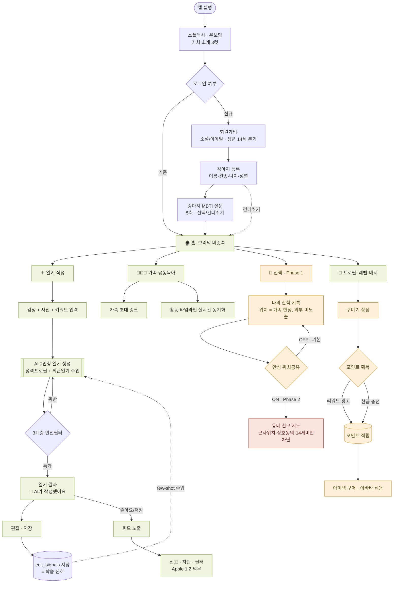
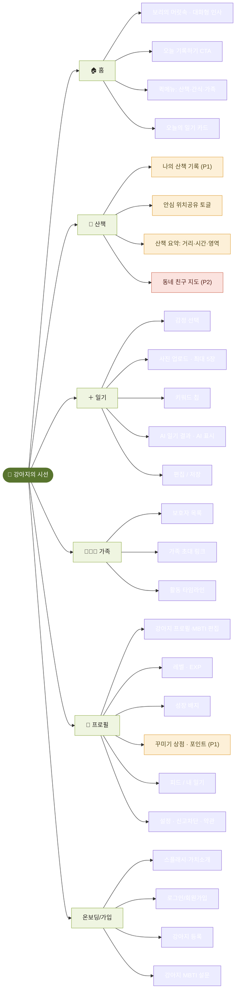

# 🐾 강아지의 시선 — 유저 플로우 & 정보구조(IA)

> 와이어프레임은 [강아지의시선_UX설계.html](강아지의시선_UX설계.html)(브라우저로 열기)에서 확인. 본 문서는 Notion/GitHub에서 바로 렌더되는 다이어그램 버전.

---

## 1. 유저 플로우 (User Flow)

핵심 가설 검증 경로(온보딩 → 홈 → AI 일기)를 중심으로, Phase 1~2(산책·위치)와 수익화(꾸미기) 분기를 포함.

**범례:** 🟩 MVP(Must) · 🟨 Phase 1 · 🟥 Phase 2
**핵심 루프:** `홈 → 일기 입력 → AI 생성 → 편집/저장 → (학습신호) → 다음 생성 품질↑` — D7 리텐션을 만드는 선순환.

---

## 2. 정보구조 (Information Architecture)

5탭 하단 네비게이션 기준 사이트맵. 괄호는 단계(Phase) 표기.

---

## 3. 화면 목록 (Wireframe Index)

| # | 화면 | 그룹 | Phase |
|---|---|---|---|
| 1 | 스플래시 · 온보딩 | 온보딩/가입 | MVP |
| 2 | 로그인 · 회원가입 | 온보딩/가입 | MVP |
| 3 | 강아지 등록 | 온보딩/가입 | MVP |
| 4 | 강아지 MBTI 설문 | 온보딩/가입 | MVP |
| 5 | 홈 · 보리의 머릿속 | 홈/일기 | MVP |
| 6 | 일기 작성 · 입력 | 홈/일기 | MVP |
| 7 | 일기 결과 · AI 생성 | 홈/일기 | MVP |
| 8 | 일기 편집 (학습 신호) | 홈/일기 | MVP |
| 9 | 피드 · 좋아요/팔로우 | 소셜/가족 | MVP |
| 10 | 신고 · 차단 (Apple 1.2) | 소셜/가족 | MVP |
| 11 | 가족 · 공동육아 | 소셜/가족 | MVP |
| 12 | 가족 초대 | 소셜/가족 | MVP |
| 13 | 산책 · 나의 기록 | 산책/위치 | Phase 1 |
| 14 | 산책 · 안심 위치공유 ON | 산책/위치 | Phase 1 |
| 15 | 동네 친구 지도 | 산책/위치 | Phase 2 |
| 16 | 프로필 · 레벨/배지 | 성장/수익화 | MVP |
| 17 | 꾸미기 상점 · 포인트 | 성장/수익화 | Phase 1 |
